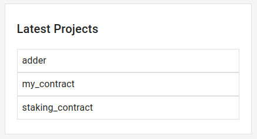

# Studio Home

The home screen is designed with simplicity and efficiency in mind, offering you a convenient interface to start your projects and manage existing ones.

## Create a New Project

The top panel features a user-friendly form that allows you to create a new project effortlessly. Here, you have two main options:

- **Project Name:** Give your project a unique name to easily identify it in your workspace.

- **Choose a Template:** You can select a predefined template to kickstart your project. These templates are designed to save you time and ensure best practices in smart contract development.

Once you've made your selections, click the "Create Project" button, and your new project will be initiated with the chosen template.

## Latest Projects

The right panel showcases your "Latest Projects," offering a quick glance at the most recent projects you've created or worked on. Each project is represented by its name and relevant details. To access a specific project, simply click on its name, and you'll be seamlessly redirected to that project's workspace.

ScenarioMX Studio is all about empowering your MultiversX smart contract development journey, starting from the moment you create your project to easily revisiting your latest endeavors. Enjoy a more efficient and intuitive development experience.
