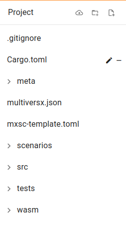
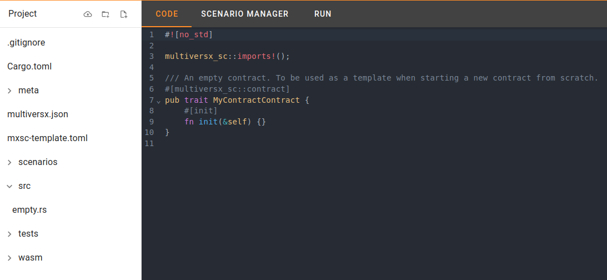
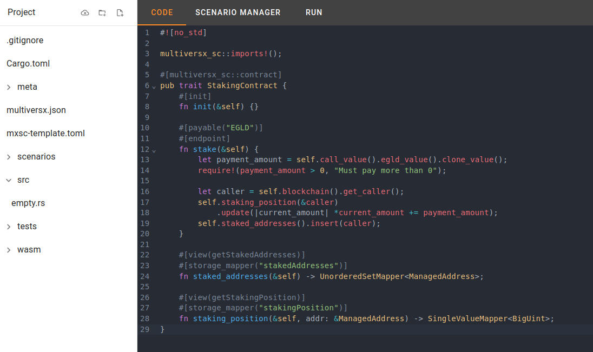

# Files Explorer

The Files Explorer is an essential feature of ScenarioMX Studio, offering a comprehensive code Integrated Development Environment (IDE). It simplifies your project's file and folder management, providing a user-friendly interface for coding and project organization.

## Key Highlights

- **Project Explorer:** The left-side navigation, called the sidenav, helps you effortlessly browse and manage project files and folders.

- **Code Editor:** The right-side code editor is your canvas for creative coding. Write, edit, and manage your code with ease.

Edit the code

- **Convenient Actions:** The sidenav includes buttons for downloading the project as a ZIP, creating new folders for organization, and generating new files.

This feature empowers you to code, edit, and manage your project efficiently, streamlining the development process.
