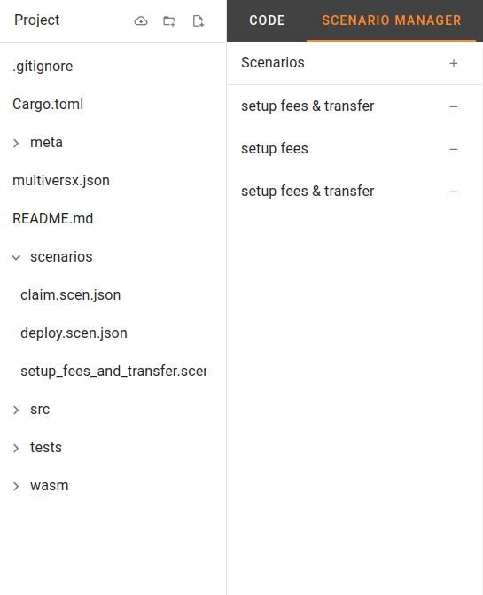
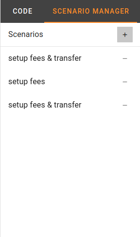
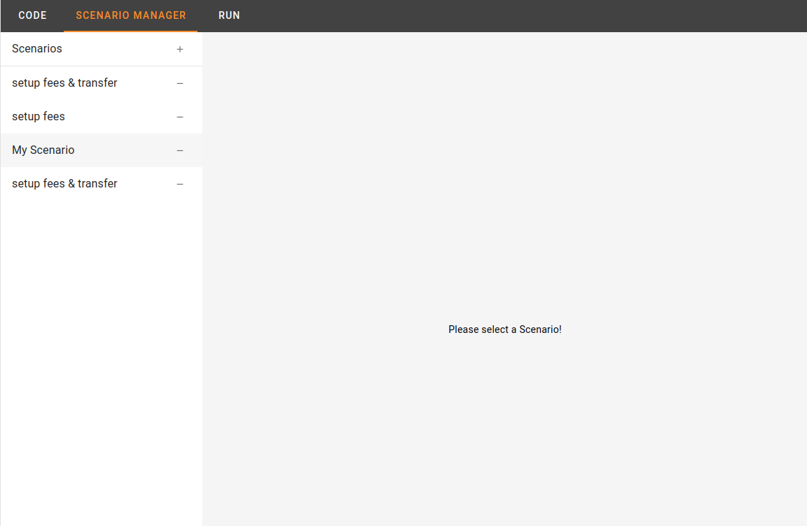
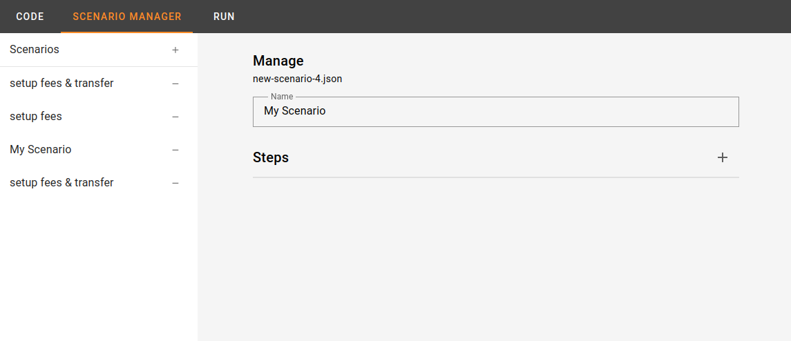
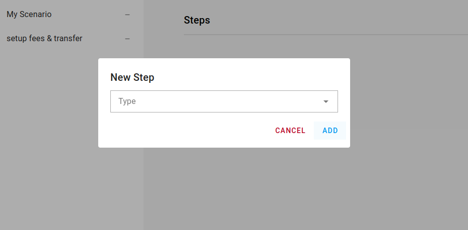
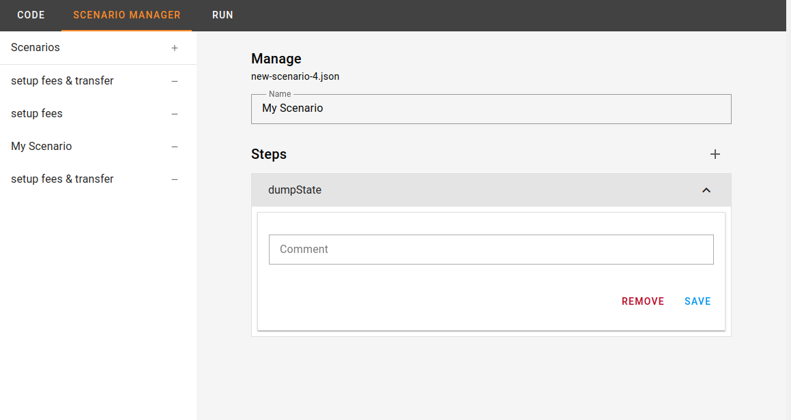
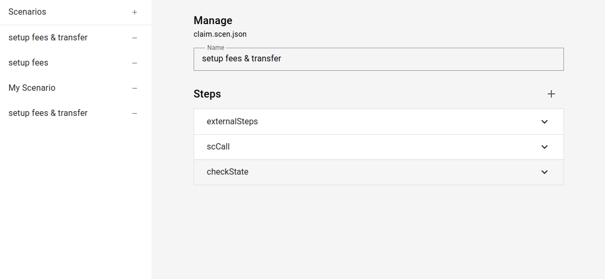
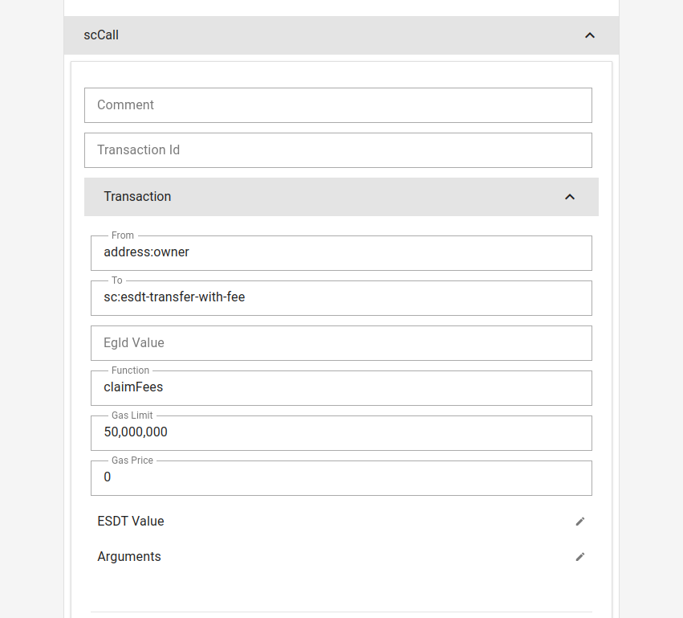

# Scenario Manager

The Scenario Manager is a specialized tool designed to enhance your smart contract project management. It streamlines scenario-based testing, ensuring a smooth testing process for your MultiversX contract projects.

## Key Features

- **Automated Scenario Tracking:** The Scenario Manager automatically tracks the "scenarios" folder within your project.

- **Effortless Scenario Creation:** Add new scenarios with a single click, simplifying the scenario management process.

- **Intuitive Step Management:** Edit scenario names and manage steps through user-friendly forms, eliminating the need to handle complex JSON files.

Select another scenario

This feature enhances the efficiency of scenario-based testing, making it easier to create and manage scenarios.

Learn more about the Scenario Manager in the [User Guide](link-to-user-guide).
