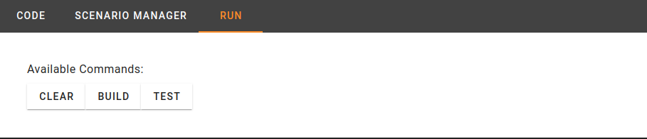
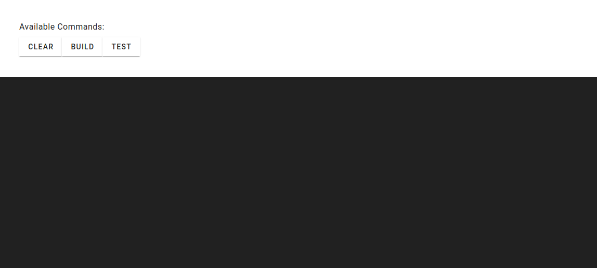
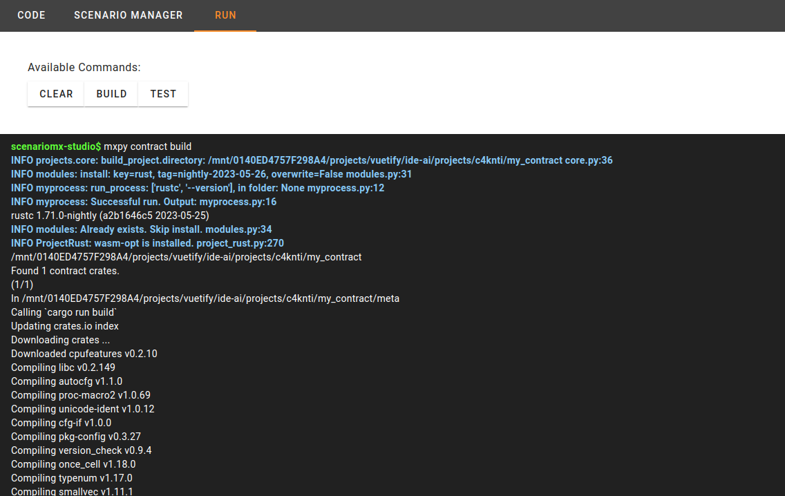
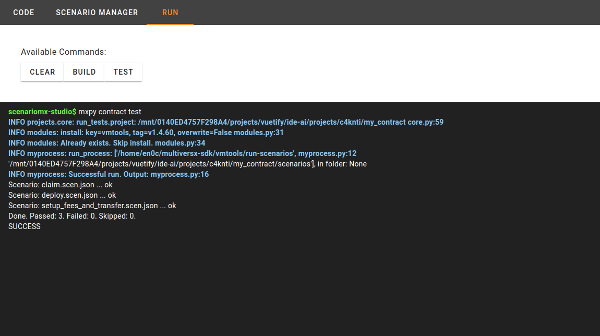

# Run Panel

The Run feature in ScenarioMX Studio is a powerful tool for executing and testing your smart contract projects. It provides a streamlined project execution experience, making it easy to validate your work.

## Key Capabilities

- **Header Commands:** The header offers commands for essential actions, including CLEAN, BUILD, and TEST.

- **CLEAN:** Clear the console and start with a clean slate for your project operations.

- **BUILD:** Initiate the project build process, installing all necessary dependencies.

- **TEST:** Execute previously created scenarios to rigorously test your project.

- **Real-Time Console:** The console interface below the header provides real-time feedback through a WebSocket connection, allowing you to monitor execution progress and receive immediate results.

The Run feature simplifies project execution, ensuring a seamless testing process for your MultiversX contract projects.
